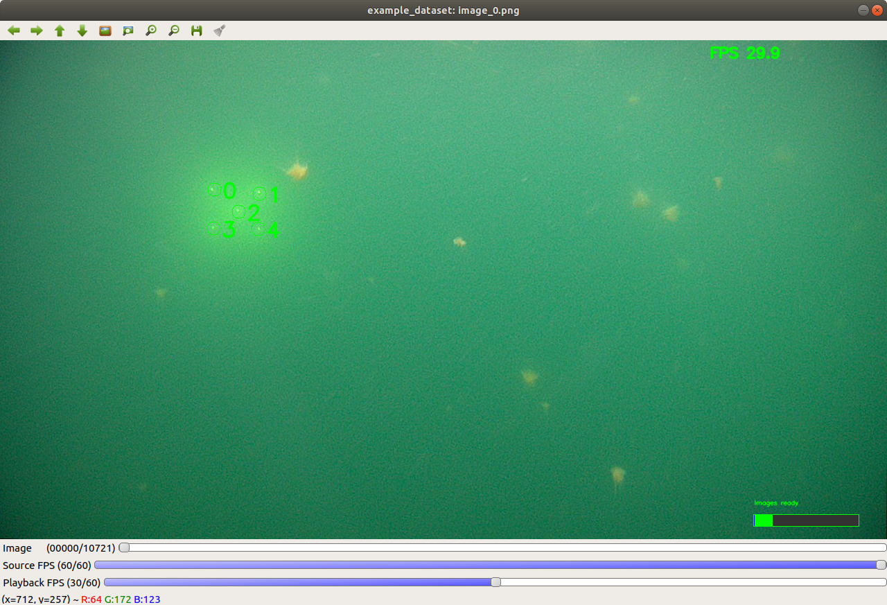

- [Running the code](#running-the-code)
- [About this project](#about)
- [How to tune](#tuning)

 
# Running the code

## tracker.launch

    roslaunch lolo_perception tracker.launch

Launches tracker_node.py + some extra helper nodes (if specified).
Launch file mainly for executing tracker_node.py (see below) with some extra functionality.

## tracker_node.py

    rosrun lolo_perception tracker_node.py

Runs the tracker (see tracker.py) in a continuous loop. 
The node subscribes to images which are fed into the tracker in tracker.py and publishes varius information such as the estimated pose from the tracker.

## image_analyze_node.py

Recorded images in a video/rosbag and want to analyze the performance of your tracker?
With image_anallyze_node.py you can create "datasets" from rosbags/videos which then can be played, acting as a source for image publishing.    

### Create a dataset

    # From a video (OpenCV supported format)
    rosrun lolo_perception image_analyze_node.py <dataset_name> -file <video_path>
    # From a rosbag
    rosrun lolo_perception image_analyze_node.py <dataset_name> -file <video_path> -topic <image_topic>
 
 A dataset created using image_analyze_node.py is a folder containing:
- the images from your video/rosbag in png format
- dataset_metadata.yaml: configuration of how the images should be played
- dataset_labelfile.txt: a human readable file containing the current labels for the dataset

Use the -h option to see all available options.

### Analyze images

    rosrun lolo_perception image_analyze_node.py <dataset_name>

While playing the dataset with image_analyze_node.py, the images will be published.

 
# About this project (TODO)

Link to master thesis: TODO

Short about the project

 
# How to tune (TODO)

Flow diagram?